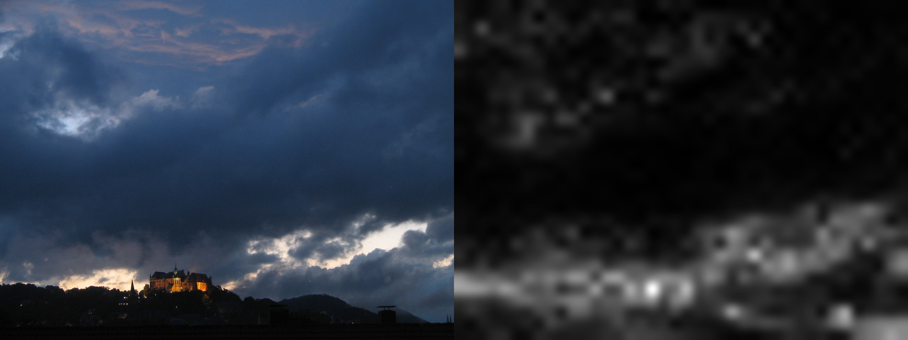
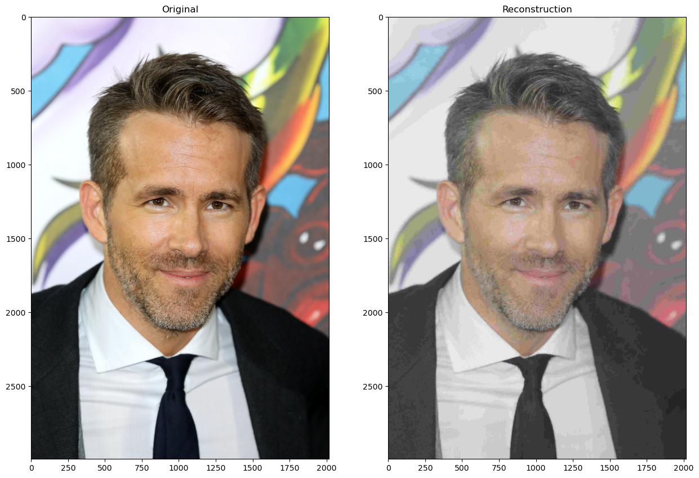
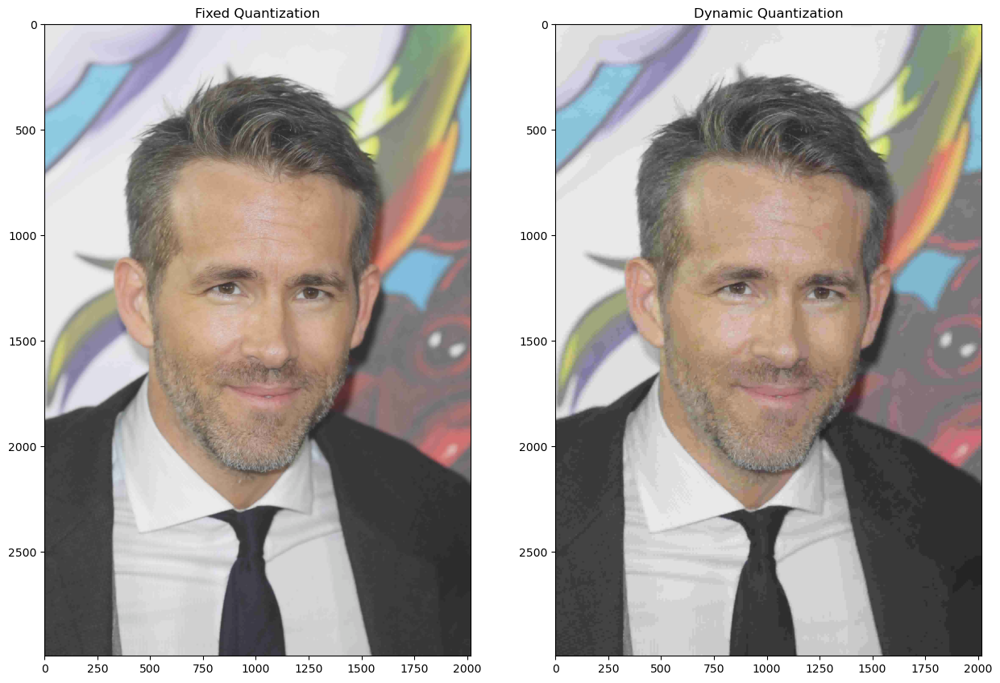
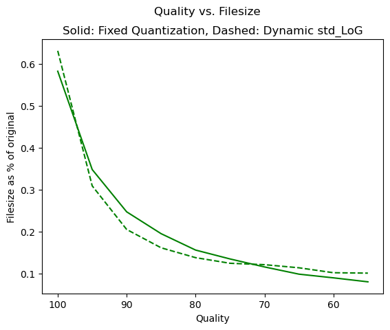
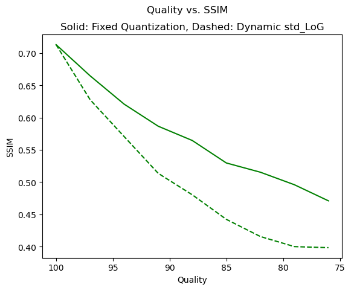
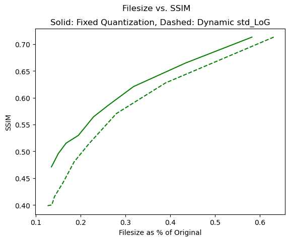
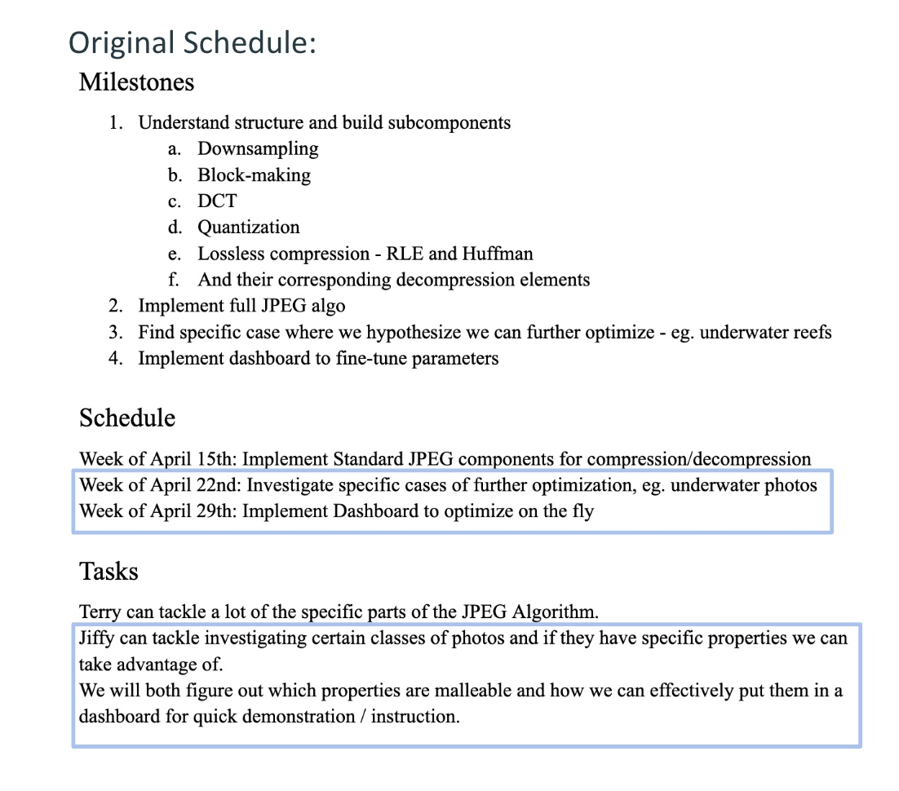
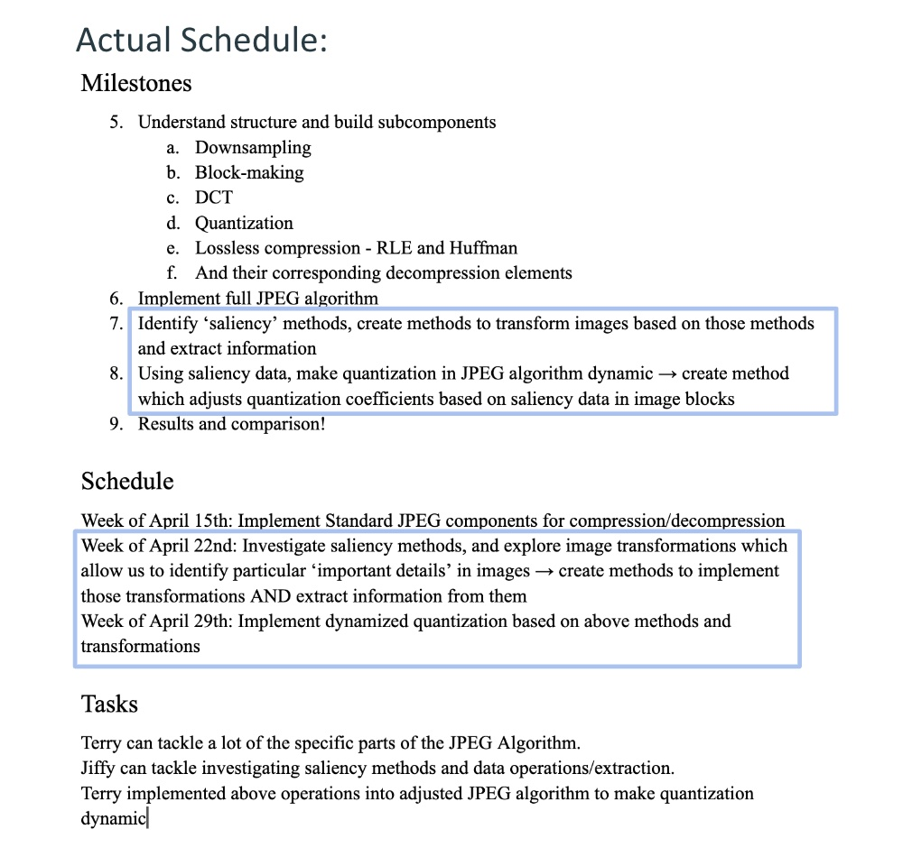

# Exploring JPEG Compression: Dynamic Quantization

## A CSCI 0452 Project by Terry Luongo and Jiffy Lesica

[Link to Github](https://github.com/terryluongo/compressiondotzip)

### **Introduction**:

Over the course of this semester, we have grounded our study of image processing in understanding digital images as a multi-dimensional arrays of data: specifically pixel/channel values. While an image itself is defined from a two-dimensional function (Gonzalez, Digital Image Processing), the data structures and values within each array dimension can be manipulated to modify a local region of an image, or apply some universal transformation across the entire image. In essence, a digital image is dimensionally organized data which can be operated on so as to extract or change the information of an image itself.

It is from this abstracted understanding that an array (no pun intended) of questions arises on digital images. Our project focuses on two in particular:

1. What can we learn about information extracted from a digital image?

2. How can we use the information we extract from an image to dynamically apply some transformation to that same image?

#### Understanding JPEG Through the Lens of Data

In particular, we applied these above questions to the JPEG compression algorithm. Since 1992, the JPEG Image Compression Method has been one of the most successful and ubiquitous algorithms in the field of image processing. As with any compression method, the JPEG algorithm works to reduce the amount of data - the means by which an image is conveyed - required to represent image information (Gonzalez 540). The algorithm takes in an image and 'identifies' repeated patterns in its data - leveraging the fact that images are stored digitally as organized arrays of data - and replaces them with shorter patterns. This allows for the file to be stored with less data, which facilitates efficient image storage and transmission. However, JPEG in particular is lossy compression. This means the algorithm throws away 'non-essential' image data. While this does allow for the image to be stored with less data, data is lost which cannot be recovered during reconstruction. Thus, while the JPEG compression algorithm reduces the size of an image file to be stored, it also reduces the resolution of an image, which can compromise image integrity.

#### How Does JPEG Work?

So, how does the JPEG algorithm actually work? The algorithm is based on 2 psychovisual principles.

1. Changes in brightness are more important than changes in color to a human observer: While the human eye has 90-120 million brightness-sensitive rods in the retina, it only has about 4.5-6 million color-sensitive cones.

2. Low-frequency changes in an image are more important than high-frequency changes: The human eye can distinguish low-frequency light changes like the edges of larger objects better than high frequency light changes like the fine details between blades of grass.

Through the following series of transformative steps, the JPEG algorithm identifies data patterns and operates on a given image array based on the above assumptions:

1. Color Conversion and Subsampling: Image data is divided into 1 luminance (Y) and 2 color (Cb, Cr) channels. The values in the color channels can be optionally subsampled - A.K.A. some 'non-essential' color values are removed from the image representation without significantly affecting the visible image info (remember psychovisual principle 1!). Each pixel value in the array represents a combination of a brightness level as well as two color values. Each of these components is seperated into its own array. Thus, each of the three channels produced by step 1 are arrays of the same dimension and size as the original image (barring downsampling of the color channels). 

2. Block-processing and DCT Transformation: For each of the three arrays we now have, each channel is further subdivided into 8x8 blocks (Ex. a 64x64 pixel image would become an 8x8 array of 8x8 pixel arrays). Each of these blocks is now transformed using the Discrete Cosine Transformation (DCT) from the spatial domain to the frequency domain. This operation gives us access to the frequency domain representation of these blocks. In other words, we can now see how much high-frequency change versus low-frequency change is present across each block of our image (remember psychovisual principle 2!).

3. Quantization: In quantization, we map the largest set of frequency values to a smaller set of discrete finite values. Quantization is where we determine the final quality of our image, and how lossy we want our compression to be. In any user-oriented implementation of JPEG compression, a person will get to choose the quality of the image that is output. Depending on the degree of quantization chosen, the quality of your compressed image will drastically change. The more quantization is applied, the more frequency information will be thrown away. This means that data values from your original channel will be mapped to a smaller set of values to represent your final image.

    Imagine this: You have an image that is represented using 4 shades of blue. The numbers 1.0, 1.1, 1.2, and 1.3 each represent a different shade of blue. If you wanted to compress this image, a more heavily quantized version would say "Hey, 1.0, 1.1, 1.2, and 1.3 all look pretty similar, so in our new image lets just set any pixel that is 1.0, 1.1, 1.2, or 1.3 to 1.0". While you'd only have to use one color value to represent your image (1.0), you will also lose all the detailed nuance of the image you originally had because every pixel is the same color! On the other hand, a lower quantization step would say "Hey, 1.0 and 1.1 look pretty similar to each other, and 1.2 and 1.3 look pretty similar to eachother. In our new image, lets set any pixel that is 1.0 or 1.1 to 1.0, and any pixel that is 1.2 or 1.3 to 1.1". Now, while we still lose some color information in our final image, we will also retain some more detail. However, since we are using 2 colors to represent the image, it will take more unique data to represent the image. Now, imagine extrapolating this basic process to hundreds of color and brightness values on very high resolution images; you can drastically impact the quality of your final image through the degree of quantization. (Note: this is, of course, not how quantization works computationally, but helps provide an intuitive imagination of the process).

    Programmatically this process works using quantization tables. A quantization table is an 8x8 table of whole numbers multiplied by a coefficient. In JPEG compression, each 8x8 DCT block of an image is divided by these quantization table and the pixel value resulting from each division is rounded to meet the smaller set of finite values you are mapping to. As you change the degree of quantization, the coefficient of each quantization table changes. The table values have been calculated mathematically according to the JPEG standard. As the degree of quantization increases, data values from the original image will be mapped to a smaller set of finite values (more image information will be lost).

    Critically, the same quantization table/coefficient will be used for every 8x8 block of your image. Thus, JPEG quantization is applied universally.

4. Reorder and Variable Length Encoding: In quantization we have technically lost frequency information, but still have the same amount of data (there is still 1 datum for each pixel in our channel). In this final step, we perform lossless data compression. By reducing the variability of pixel values in step 3, we have made our image 'more compressible'. Traversing through the 2D array at each block in a zig-zag pattern, we order our new set of pixel values from lowest frequency to highest frequency, and now have repeated chunks of data next to each other to compress. Runtime length encoding is finally applied to take advantage of large stretches of 0's due to quantization.

#### The First Question: Make it Dynamic?

As mentioned above, the JPEG quantization is applied universally. Regardless of the particular frequncies of an 8x8 DCT block the same quantization table is used on every block. Unfortunately, blocks with what may be visually important details will get compressed as much as those with non-essential details. Similarily, blocks which represent non-essential details will use extraneous data to represent little information. We began to wonder this had be the case. We landed on the question that would drive our entire project: *How could we make quantization dynamic?* - can we extract information about what is 'important' in our 8x8 DCT blocks and use that information to dynamically apply an 'optimal' degree of quantization on each of our DCT blocks? To put it more simply, does quantization have to be universal?

#### Saliency Methods:

From this question, we began to explore the information that can be extracted from our 8x8 image blocks, and images in general. Was there anything that could actually indicate what was visually 'important' in an image? Thanks to the advice of Professor Vaccari, we came across the concept of saliency. In essence, saliency refers to what "stands out" in a photo or scene. Every day of our lives humans employ the process of saliency detection to automatically locate the 'important' part of an image or scene which they face and focus on it: we automatically try to determine the most important parts of the world we see before us!

In computer vision, a saliency map can be produced from an image to actually highlight the regions on which people's eyes first focus. For example, in the below image comparison you can see how the saliency map on the right-hand side actually brightens some of the regions of the original image on the left-hand side; the castle and the bright patches in the clouds are all highlighted in the map. These are the parts of the image our eyes immediately lock on to (Image by Mariusthart, via Wikimedia Commons).

 

This discovery was exactly what we were looking for, and brought us to the second essential question of our project: Knowing what the saliency map represents, could we the information it holds to dynamically and efficiently compress our original image?

#### Expanding and Exploring Saliency

From this point, we chose to expand our exploration of saliency to other metrics or image transformations which could help us identify what 'stands out' in an image and adjust compression accordingly. We ultimately landed on 3 different expanded saliency methods:

1. Saliency Maps: Transformed images which themselves highlight the salient details in an original image.

2. DCT: An image's DCT represents not just the frequencies which are present in a given image, but more importantly use pixel intensity to represent how often those frequencies are present in an image (the brighter a pixel on a DCT, the more often the frequency associated with that frequency appears in the original image). This was particularly interesting considering the JPEG Algorithm already operates on these blocks.

3. Difference of Gaussian (DoG)/Laplacian of Gaussian (LoG) for Edge Detection: An LoG filter can be applied over an image to highlight edges of certain sizes/widths within an image. LoG can be approximated using an adjusted DoG filter which is computationally more efficient.

### **Methods**:

#### Step 1: Implementing Basic JPEG Algorithm

The first step was to implement the basic JPEG algorithm. Terry created a codec file which included a function definition for each method required in both JPEG compression and decompression. By defining our own methods for each step of the process, we had the advantage of both A. getting a detailed understanding of the algorithm before adjusting it and B. being able to make later additions/changes to our algorithm to help us dynamically adjust quantization. Terry then created a JPEG class file which image files could be loaded, and run through the methods defined in the CODEC file.

#### Step 2: Transforming By Saliency

Once we had a fundamental grasp on the JPEG algorithm implementation, it came time to work on the saliency methods upon which we would dynamize it. Knowing that quantization was performed on the 8x8 DCT blocks of the original image, we decided to applyour saliency methods to each 8x8 block of our image separately so that the information extracted from them - which will be used to dynamically adjust quantization - will be local to the block too. For example, we would not calculate the saliency map of an image all at once, but the saliency map of each 8x8 block in the original image which corresponds to the DCT blocks to be quantized. The libraries we used to implement these methods are as follows:

1. Saliency Maps: OpenCV implements static saliency - the saliency of a single, still image frame - by two methods. In each method, the resulting pixels of the saliency map have a brightness value which is proportional to the saliency of the corresponding pixel in the original image.

    a. Spectral Residual (SR): Spends less time computing the saliency of each frame, resulting in quicker computation but less detailed saliency map.

    b. Fine Grained (FG): A more detailed approachs that works 'better' when the details of an image are very small. However, it takes longer to operate on an image.

    We preferred to work with the Fine Grained method as - despite the computational slowdown - our aim was to retain details in our image which FG facilitated in more than SR.

2. DCT Blocks: Using the Scipy FFT Package we performed a DCT on each 8x8 block in our original image, giving us the local frequency domain representations of our image blocks.

3. DoG/LoG: Using Skimage's DoG function we approximated an LoG filter for our images. By adjusting the sigma value passed to our filter we can change the size of the Gaussian filter initially passed over our image and isolate edges of specific sizes to be highlighted. To approximate the LoG, pass None to the high_sigma parameter of Skimage's DoG function and the high_sigma will be calculated as 1.6x the low_sigma value passed to the function. This ratio - originally proposed by Marr and Hildreth in 1980.

#### Step 3: Extracting From Saliency

Now having the saliency of our 8x8 blocks established, we needed to choose what information we could extract to adjust our JPEG quantization. We knew that in blocks with more salient information - the more important details in that block - we wanted to quantize those blocks to a lesser degree. We also know that in each of thse saliency blocks, pixel luminance was represented proportionally to the saliency of that pixel in the original. So, we decided two ways we could calulate the saliency across a whole 8x8 block was by taking the mean and/or standard deviation luminance value of that block.

Following step 2 and step 3, for any given image we now had a 2-dimensional saliency block whose values represented the mean saliency or standard deviation of saliency for each corresponding 8x8 block which will be quantized in the JPEG algorithm.

Example. Steps 2 and 3 Illustratred Intuitively:

- Say we start off with a 64x64 pixel image we want to compress using our JPEG algorithm, this means that during the DCT transformation step of the algorithm it will be split up into an 8x8 array of 8x8 pixel DCT blocks. Imagine each of these DCT blocks as its own whole unit which can be operated on. This would mean there is now an 8x8 array of individual DCT units which are about to be quantized (note: each of these units still holds a 2D set of values, but this visualization aids in the intuitive explanation of our procedure).

- Now, say we want to calculate the saliency maps within the 64x64 pixel image to dynamically adjust quantization on the above mentioned blocks. In the same way we indpendently apply the DCT transformation on each 8x8 block within our image, we will apply our saliency function provided by scipy. We now will have an 8x8 array of 8x8 pixel saliency blocks which highlight the important details within regions of our original image. Imagine again that each of these blocks is an independent unit which can be operated on independently of the others in the array. We thus have an 8x8 array of individual saliency maps.

- Now, say we choose to calculate the mean luminance of the pixels in each of these 8x8 saliency blocks. Once that is complete, we will have an 8x8 saliency array whose values each represent the mean saliency value of a corresponding region in our DCT array which are waiting for quantization. The [0,0] index of the saliency array corresponds to the the [0,0] index of the DCT array which is about to be quantized. The [0,1] index of the saliency array corresponds to the saliency of the [0,1] index of the DCT array which is about to be quantized. Ultimately [0,0]-[7,7] index of the saliency array will always correspond of the [0,0]-[7,7] index of the DCT array which is about to be quantized.

#### Step 4: Dynamically Adjusting Quantization

The question then arrived of what we would do with these value arrays? Thankfully, we knew what they represented! Each value corresponds to the intensity of a certain image feature that we might want to adjust quantization around. For example - as mentioned above - the saliency map of an image highlights the "most important" part of the image from which it is created. So, a high mean luminance of a saliency map region may suggest that region contains a lot of important information that we may not want to lose. A block's standard deviation of luminance can inform us similarly. A high standard deviation may suggest that there are various degrees of detail in an image block which we may not want to lose. So, when we ultimately compress our image, we want to somehow create a way to check how bright the saliency block is, and subsequently minimize the quantization factor applied to it during compression. 

Thus knowing what each of our values represented, we created dynamic quantization methods which first took the final salient version of the image to be compressed, and assigned a 'quality value' between [0-100] to each of the image blocks based on the final quality percentage we wanted our compressed image to be compared to our original. I know, very confusing and a lot of 'quality'. But, I'll clarify by a lovely narrative example:

Remember the 8x8 block that created above for our DCT transformed image? We now imagine we perform that same process on a saliency map of our image. Still 8x8 blocks, but now each block holds the mean luminance value of all the pixels within that saliency map block. Now, we want to perform a JPEG compression on our original image, but base the quantization off of these means values. First, we select a quality for our final image: 90% sounds good. Our final image should be 90% of the quality of our original image based on our algorithm. In an 90% compression, there are a lot more frequencies we want to keep. Our final image should resemble the image without distortion, so we keep more frequencies and only throw away the details that are really, really not necessary. So, knowing we want 90% quality, we send our 8x8 block through a function which assigns each block a quality value between [0-100] based on that blocks average luminance. The higher the brightness, the higher quality that block is assigned. And, since we want to retain a lot more information with 90% compression - compared to, say, a 40% quality compression - our function is willing to dish out a lot more high quality scores: there is a much bigger range of frequencies that it wants to keep safe from compression. As we drop our final output image quality, our function algorithmically restricts the range of mean luminance values it is willing to give a high score. This ultimately will lead to more frequencies being lost, quantization intensified, and a lower quality output image.

Now we have an image where each block has a value between [0-100] in each block, with 100 marking a perfect amount of quality ("don't lose any of this information!"), and 0 marking no quality at all ("you can lose every bit of information in this block, I don't care"). We then pass this array through a function which iterates through each of the 8x8 blocks, and calculate a quantization matrix according to that blocks quality score. Essentially, given a global quality level of 0.8, a 0 in saliency will become a local 60 quality level, and a 100 in saliency will become a local 100 quality level.  These qualities levels will be used to calculate the quantization matrix for each block in the image.  These matrices in turn will be used to quantize its corresponding block in our original image. So, all those blocks that got higher and higher quality will produce matrices that quantize less and less. And, all those blocks that were assigned low and lower quality scores will increase the degree of quantization on their corresponding image block. These distinct quantization matrices are then applied to our to-be-compressed image, and the rest of the JPEG algorithm follows suit.

### **Results**:

To break the bad news early, our results were not very favorable for dynamic quantization as we have it currently programmed. We employed both visual and quantitaive measures to see how we and the numbers felt the images compressed with dynamic quantization compared to those compressed with fixed quantization. You can find access the metrics we compared and how we adjusted paramters to do so in the 'jpeg.ipynb' file in our repository, and images of plots for all metrics in the all_plots folder in our repository. To provide a working example of wthe measures we explored I can highlight the results of a specific saliency method: the Standard Deviation of a DoG/LoG with a Gaussian pre-filter sigma of 5, and compression quality of 80%.

 
    

 

As we can see from the plotted images, our algorithm does on a purely visual level what we expect a JPEG compression algorithm to do. At 80% compression, We have clearly lost color information - albeit more than we may have hoped - as well as reduced visual resolution - as can be seen from the distortive aliasing which is apparent around the output image.

 

 

Our next result came from visually comparing the result of 80% compression of our image using both fixed and dynamic quantization. As you can see, both fixed and dynamic quantization seem to subsample the same amount of color data from our original image. The biggest difference comes in the clarity of the output image. With fixed quantization, there are no spatial distortions being clearly introduced at 80% compression. With dynamic quantization, we notice the same blotchy patches on Ryan's left shoulder (our right), as well as some distortion on his face.

 

 

One of the areas where dynamic quantization works best - at least with the LoG standard deviation method - is the relationship between image quality and filesize. As seen by the graph, dynamic quantization actually resulted in  filesizes which were a smaller percentage of the original image size for high and mid-quality images.

 

 

On of the weakest points of dynamic quantization's performance is when it comes to comparing JPEQ quality and SSIM values. SSIM stands for the Structural Similarity Index Measure, and is used to try and quantify how good the perceptive/visual quality of an image is. As shown by the graph, images compressed using dynamic quantization lose quality more steeply as JPEG quality decreases. A 100% quality JPEG and 60% quality JPEG, compressed using fixed quantization, have respective SSIMs of just over 0.70 and just over 0.40 when compared with our original image. If you look at the same quality JPEG compressions using dynamic compression, we see a drop from an SSIM just over 0.70 to just over 0.35 when compared with out original image.

 

 

The final measure we looked at was Filesive vs. SSIM. In other words, do compressed images of the same size look better if they have used fixed quantization or dynamic quantization? Again, dynamic quantization was beat out by fixed quantization. While both follow a similar trend on the graph, the SSIM values for dynamically quantized JPEGs are consistently lower those produced by fixed quantization and of equivalent filesize.

### **Accessibility**

With the proper implementation and effective education, we do believe this algorithm is accessible. In it's current form we don't believe it is necessarily the easiest to use or understand for those not well-versed in concepts of image frequency, compression algorithms, and saliency detection. Removing the need for hard-coding the compression, and replacing the algorithm steps with an intuitive, well-detailed, and user-friendly would make this a fun exploration for anyone interested in how digital images work and how/why we modify them.

### **Ethical Implications**

The ethical implications of JPEG compression fall under the umbrella of lossy compression algorithms in general. In certain fields of digital image processing - particularly those that require very high-resolution imaging - experts suggest avoiding JPEG compression as much as possible. This is because - as seen above - the algorithm causes changes in resolution AND the intensity value of any given pixel in an image. If this goes too far, one might lose crucial details needed to analyze the image.

This is also, however, where we hope our algorithm could be of use (if most optimally implemented). By making quantization dynamic, we can emphasize quantization on the 'less important' regions of an image so as to reduce the loss of detail in the image's more salient regions while keeping compressed file size low. In doing so, a dynamic approach to JPEG compression could help us retain an image's integrity at higher degrees of compression.

### **Schedule**

 
    
    

 

Our original schedule did not have a distinct vision for what the goal of our project was. We presented it as an exploration of JPEG compression, and early on had the idea to see how the algorithm could be optimized for different subclasses of images. This was what we originally planned our schedule around: we would learn about the algorithm on the whole first, then identify subclasses that could benefit from an optimized JPEG compression algorithm, and them implement the necessary optimizations.That middle idea is what changed the most. Terry spent the first week implementing an version of a JPEG algorithm which we could play with and customize as needed. Then, Jiffy spent the second week of the project trying to identify a specific step of the JPEG algorithm to modify - quantization - and how/on what grounds we could modify this process - adjusting quantization based on saliency metrics. From there Jiffy wrote the code to calculate those metrics in a way that could make them more easily accessed by during quantization. With these methods, Terry worked to build the bridge between saliency and JPEG by creating and applying dynamic quantization methods to our compression algorithm. We then worked jointly on the presentation and this report, bringing what we learned to eachother trying to convey it in a productive manner.

### **Issues**

We encountered some challenges early on in the development of our original JPEG algorithm/class. In particular, when doing the research to try and determine our base quantization table values, it was difficult to find sources with reliably consistent or accessible indication of standard quantization values. Thankfully Terry was able to work out a functioning quantization table, but before that we were struggling to have reasonable color downsampling in our output images: they looked ridiculous. Through the second week, the issue we faced was developing a clear vision for the project. It took lots of discussions with each other and Professor Vaccari, but we ultimately came out with eagerness to explore saliency and quantization. Jiffy also struggled in coding saliency methods which would calculate saliency values for 8x8 blocks. Given that these values would ultimately correspond with and affect the quantization of image blocks during compression, saliency arrays had to be kept in dimensions such that their values could remain most directly available for access by the compression algorithm.

### **Future Work**

One of the biggest things we hope to work on in the future is the implementation of a separate quantization table for an image's color channels. Currently we used the same quantization table to quantize each of the YCbCr channels during compression, but further research has shown that using a separate/different quantization table for color channels can protect an image from losing too much color during this process. We also were curious about running our saliency matrices through the lossless portion of the JPEG algorithm themselves and seeing how that might effect the compression of an original image. And, finally, we hope to explore more saliency methods outside of DCT, saliency maps, and LoG, as well as different frequency spaces and statistical measures from which we can dynamize quantization.

### **References**

Cromey, Douglas. “Digital Image Ethics: Ua Microscopy Alliance.” Digital Image Ethics | UA Microscopy Alliance, microscopy.arizona.edu/learn/digital-image-ethics. Accessed 9 May 2024. 

González, Rafael C., and Richard E. Woods. Digital Image Processing, Fourth Edition. Pearson-Prentice Hall, 2018. 

Jennings, Christopher. “How JPEG Works.” How JPEG Works (Christopher G. Jennings), cgjennings.ca/articles/jpeg-compression/. Accessed 9 May 2024.

Mariusthart. “Saliency Map.” Wikipedia, Wikimedia Foundation, 15 Jan. 2024, en.wikipedia.org/wiki/Saliency_map#/media/File:Saliencymap_example.jpg. 

Marr, D., and E. Hildrith. “Theory of Edge Detection | Proceedings of the Royal Society of London. Series B. Biological Sciences.” The Royal Society Publishing, royalsocietypublishing.org/doi/10.1098/rspb.1980.0020. Accessed 20 May 2024. 

Mostafaie, Fateme, et al. A General Framework for Saliency Detection Methods, Department of Electrical and Computer Engineering, Isfahan University of Technology, Isfahan, Iran & Department of Electrical and Computer Engineering, McMaster University, Canada, arxiv.org/pdf/1912.12027. Accessed 9 May 2024. 

“JPEG.” Wikipedia, Wikimedia Foundation, 16 Apr. 2024, en.wikipedia.org/wiki/JPEG.
